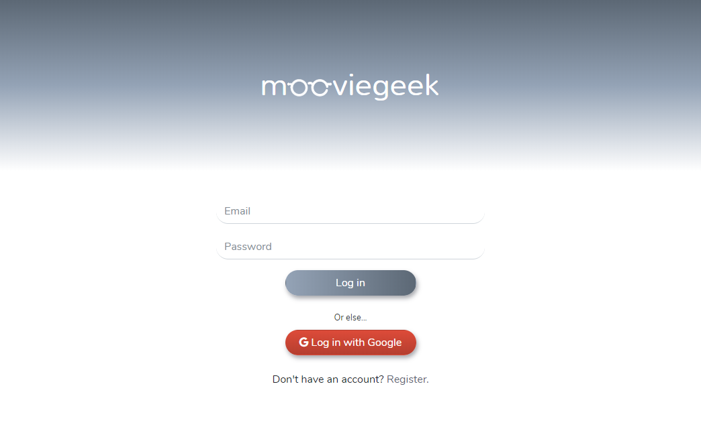
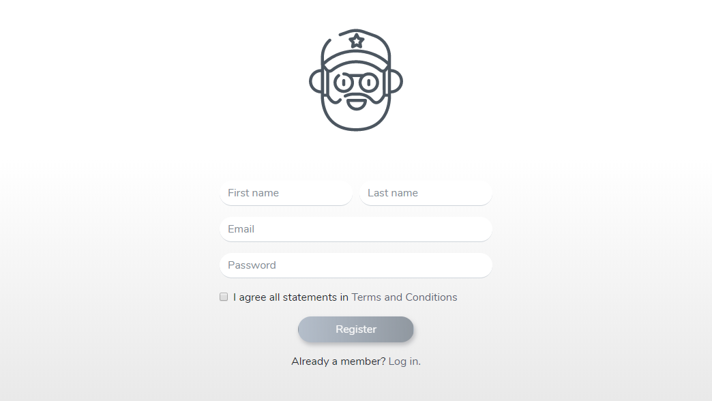
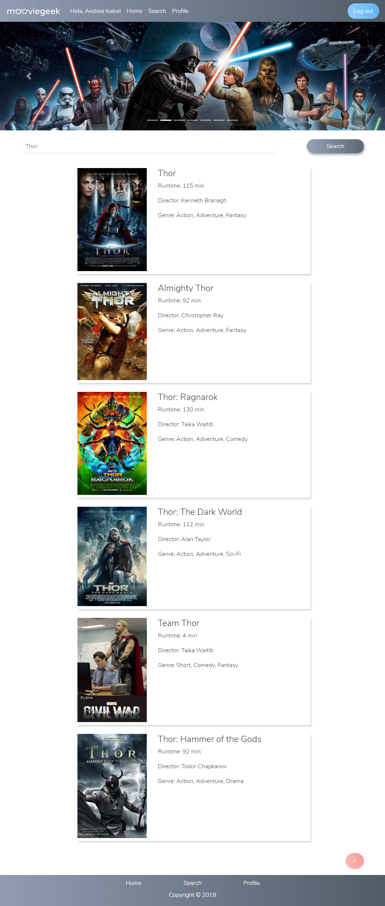
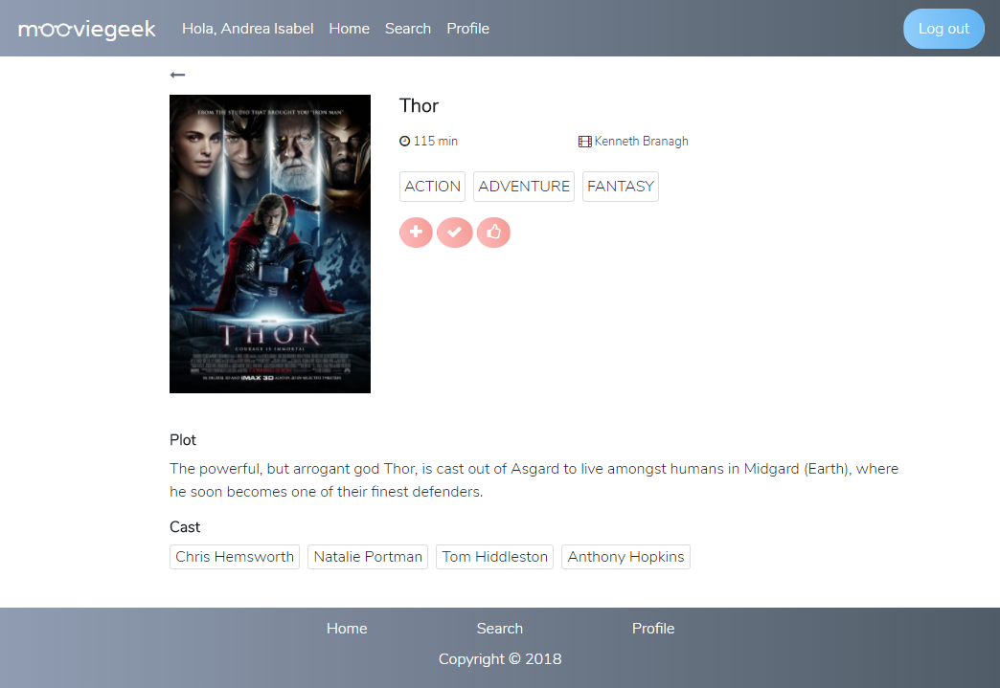
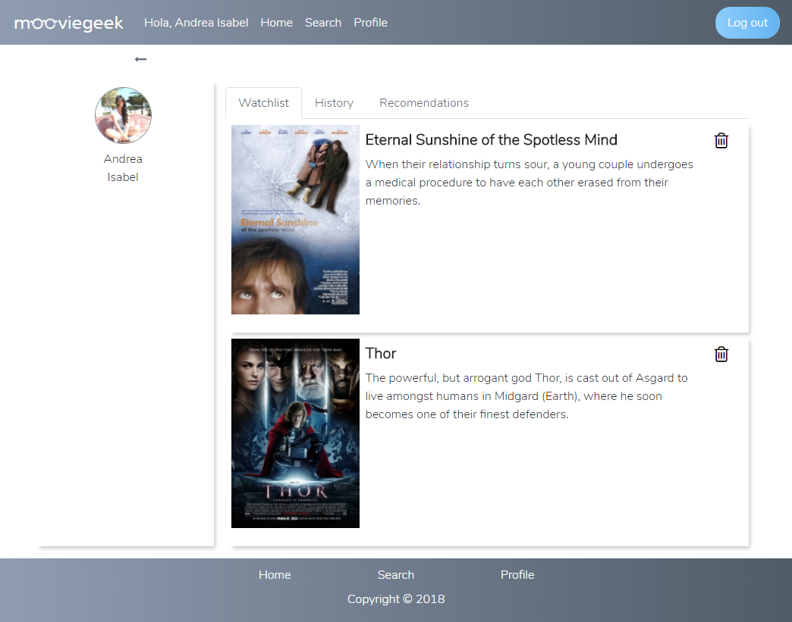

# Movie Geek

**Movie Geek** es un aplicativo, enfocado al público geek, que brinda información sobre películas del género de ciencia ficción. Además, permite a los usuarios registrados llevar cuenta de las películas, que ya vieron o quieren, ver mediante listas.

## Desarrollado para [Laboratoria](http://laboratoria.la) 

Para desarrollar el producto seguimos el siguiente flujo de trabajo:

#### 1 . Identificación del problema

  Hoy en día, existe un boom en lo que se refiere a películas de ciencia ficción y en la cultura geek en general. Esto se puede evidenciar en la gran cantidad de contenido cinematográfico con respecto a este tema, y el movimiento que esto genera en el público: el ir a verlo, disfrutarlo, calificarlo y criticarlo. Sin embargo, hasta el momento, no hemos encontrado una plataforma que se enfoque en este público consumidor específico, en la que pueda encontrar toda la información sobre este tipo de películas.

#### 2. Identificación del usuario

  La persona que busca esta información suele ser conocedora, sino experta en la materia. Por ejemplo, Julio, quien es diseñador gráfico, tiene 25 años y es un geek ávido de películas sci-fi. Él conoce el director, los actores, le interesa la cinematografía, la dirección fotográfica, la banda sonora. Es detallista, selectivo y exigente en cuanto a las películas que ve y las investiga antes de verlas en medio digitales. Le interesa la calificación de las películas con una vista estadísticamente gráfica (del 1 al 5, del 1 al 10, 5 estrellitas o un dedito arriba). Necesita obtener información relativamente general pero precisa de las películas que le gustan.

#### 3. Entrevista a los usuarios

  Se realizó una entrevista a 2 usuarios con la siguiente lista de preguntas:
  * ¿Por qué te gustan las películas sci-fi?
  * ¿Qué quieres encontrar cuando buscas información de una película de sci-fi?
  * ¿Qué te gusta encontrar cuando buscas información de una película de sci-fi?
  * ¿Qué te molesta no encontrar cuando buscas información de una película de sci-fi?
  * ¿Qué es lo primero en que te fijas cuando ves una app o web de información de una película sci-fi?
  * ¿Cuál es la mejor y la peor app o página web que brinde información sobre películas sci-fi? ¿Por qué?
  * ¿Qué clase de información te gustaría encontrar acerca de una película sci-fi?
  * ¿Dónde ves este tipo de películas y por qué?
  * ¿Vas a verlas solo o acompañado? ¿Con quién?

  Con estas preguntas, se logró entender y perfilar los intereses y problemas que tenían los usuarios cuando buscaban información de una película sci-fi. Por ejemplo, se notó que son personas selectivas en cuanto a las películas sci-fi que veían en cuanto al guión que debía representar coherencia y enrequecimiento cultural o científico. Se fijan en el arte promocional, como los posters, la clase de sinopsis que se presenta y los comentarios de otros usuarios, los que no deben ser muy reveladores, el logo de la app o web que visitan, la presentación de información general, pero específica, la calificación de otros usuarios mediante diferentes tipos de demostraciones, como estrellitas, puntuación del 1 al 5 o del 1 al 10, dedito arriba o algún otro tipo de iconografía. Suelen buscar información sobre diferentes categorías, pero en ambos casos, coincidieron en tener un interés por el guión, la cinematografía y el soundtrack. Asimismo, al buscar información de películas sci-fi suelen alternar entre diferentes fuentes, como blogs y páginas web, pero que suelen tener spoilers, ya sea en la sinopsis o en la sección de comentarios de otros usuarios, además de que carecían de algún u otro dato específico como las categorías previamente mencionadas u otras, como datos curiosos de las películas, si estas contenían escenas post-créditos, alertar acerca de los próximos estrenos, películas relacionadas y permitirles llevar un registro de las películas que les gustan y que ya han visto.

#### 4. Elaboración del sketch:

  De acuerdo al perfil del usuario hemos planteado un sketch que tiene un flujo de las vistas a las que este puede acceder.

#### 5. Testeo con el usuario:
  Se mostró el sketch a los usuarios para ver si les resultaba útil la distribución de la propuesta de la web app. La mayoría de la distribución y funcionalidad fue entendida y aceptada, excepto la ubicación de los íconos que permitirían agregar una película a su lista de películas por ver y las que ya han visto. Sugirieron ubicarlos debajo del título, duración, director y género de la película, en vez de estar sobre la imagen del poster.
  En base a este feedfack, se procedió a hacer las modificaciones respectivas.

### Organización del trabajo

Para elaborar el producto las tareas fueron distribuidas de la siguiente manera:

### Flujo de la aplicación:

### Recursos utilizados

* jQuery
* Bootstrap 4
* Firebase
* OMDB API

### Desarrollo

* Andrea Chumioque
* Lizbeth Felix
* Katherine Lévano

## UX Design

* Shannon Rivera